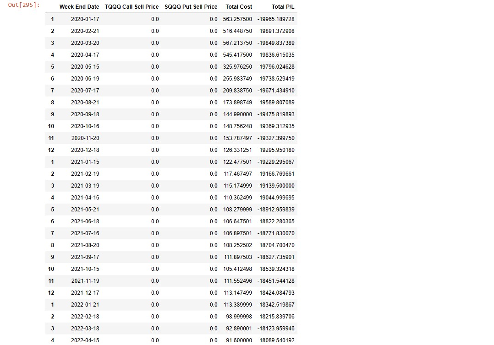

<h1>Trading</h1>
<h3>Description</h3>

A script to buy ATM monthly call spreads in TQQQ and at the same time buy SQQQ ATM monthly put spreads at the mid-market rate every Friday. 
Make both spreads 5% wide and have it as a variable so I can adjust later.  
Close the position on the day of the options expiration or the last working day of that week, if the market is closed on that day.  
The code should use data from a predifened start and end date. 
Record profit loss from each sale in the portfolio and give updates on weekly portfolio returns. 
<a href="Code_Output/newbook.html">Check Full Code</a>

 
  
<a href="Code_Output/newbook.html">Check Full Code</a>